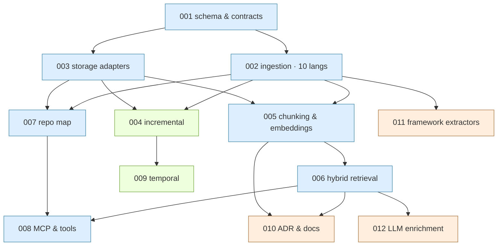

# agentforge-graph — feature tracker

Single board for all features: status, dependencies, what's ready to
pick, and milestones. Specs live alongside in
[`docs/features/`](.); catalogue in [`README.md`](README.md).

> **How to read this with the pipeline.** The workspace
> [development pipeline](../../../../.claude/development-pipeline.md)
> Stage 1 says: *pick the lowest-numbered `proposed` feature whose
> dependencies are all `shipped`*. The **Ready now** section below is
> that computation, kept current. Active per-feature work state lives
> in `.claude/state/current.md` once the project is scaffolded — this
> tracker is the planning/dependency view, not the live work log.

_Last updated: 2026-06-14 · **MVP feature-complete, NOT yet 0.1.** All 12 features
≥MVP (001/002/003/005/006/007/008 shipped; 004 incremental; 010 ADR + 011
frameworks MVP; 012 enrichment tags+summaries). Python/TS/JS packs. **OSS-prep
done** (Apache-2.0 PR #17). **ENH-003 DONE** — registry seam (PR #18) + non-Bedrock
adapters: direct Anthropic API + OpenAI/local embeddings (PR #20). **0.1 is now a
PRODUCTION-GRADE bar, not "MVP complete"** — see [Road to 0.1](#road-to-01--production-hardening).
Before tagging: validate graph knowledge on real OSS repos across every language
we claim (`docs/validation/`), prove MCP consumption by a real agent
(`docs/guides/using-over-mcp.md`), land the remaining language packs, fill gaps,
resolve storage backends (ENH-004). Release prep (version bump / changelog / tag)
comes AFTER hardening, not now._

---

## Status snapshot

Legend: `proposed` → `accepted` → `in-progress` → `shipped` (also
`deferred` / `dropped`). **Ready** = every dependency is `shipped`.

| ID | Title | Layer | Target | Status | Depends on | Blocks | Ready? |
|---|---|---|---|---|---|---|---|
| [001](feat-001-graph-schema-and-core-contracts.md) | Graph schema & core contracts | 0 core | 0.1 | shipped | — | all | ✅ |
| [002](feat-002-tree-sitter-ingestion.md) | Tree-sitter ingestion (Python; rest follow-up) | 0 core | 0.1 | in-progress (PR pending) | 001 | 004,005,007,011 | 🔨 building |
| [003](feat-003-graph-storage-adapters.md) | Graph & vector storage adapters | 0 core | 0.1 | shipped | 001 | 004,005,007 | ✅ |
| [005](feat-005-ast-chunking-and-embeddings.md) | AST chunking & embeddings | 1 serve | 0.1 | shipped | 002,003 | 006,010 | ✅ |
| [007](feat-007-repo-map-summarization.md) | Budget-aware repo map | 1 serve | 0.1 | in-progress (PR pending) | 002,003 | 008 | 🔨 building |
| [006](feat-006-hybrid-retrieval.md) | Hybrid retrieval (vector+graph) | 1 serve | 0.1 | shipped | 005 | 008,010,012 | ✅ |
| [008](feat-008-mcp-server-and-tool-api.md) | MCP server & tool API | 1 serve | 0.1 | shipped | 006,007 | — | ✅ |
| [004](feat-004-incremental-indexing.md) | Incremental indexing | 2 incr | 0.2 | shipped | 002,003 | 009 | ✅ |
| [009](feat-009-temporal-evolution-layer.md) | Temporal / git evolution | 2 incr | 0.3 | proposed | 004 | — | ⛔ |
| [010](feat-010-adr-and-docs-ingestion.md) | ADR & docs ingestion | 3 diff | 0.3 | MVP shipped (ADR → GOVERNS) | 005,006 | — | 🟡 |
| [011](feat-011-framework-extractors.md) | Framework-aware extractors | 3 diff | 0.4 | MVP shipped (FastAPI routes) | 002 | — | 🟡 |
| [012](feat-012-llm-enrichment.md) | LLM enrichment (summaries, tags) | 3 diff | 0.4 | shipped (tags + summaries) | 006 | — | ✅ |

---

## Dependency graph

Text form of the edges (parent → unblocks):

- **001** → 002, 003
- **002** → 004, 005, 007, 011
- **003** → 004, 005, 007
- **005** → 006, 010
- **006** → 008, 010, 012
- **007** → 008
- **004** → 009

---

## Build waves (max parallelism)

Each wave can start once the previous wave's features it depends on are
`shipped`. Within a wave, features are independent and parallelizable.

| Wave | Features | Notes |
|---|---|---|
| 1 | **001** | The only unblocked starting point. Everything waits on the schema. |
| 2 | **002**, **003** | Parallel once 001 ships. 002 is itself 10 parallel language packs. |
| 3 | **005**, **007**, **011**, **004** | All need only {002,003}; 011 needs just 002. |
| 4 | **006**, **009** | 006 needs 005; 009 needs 004. |
| 5 | **008**, **010**, **012** | 008 completes the MVP; 010/012 are differentiators. |

**Critical path to MVP** (feat-008 shippable):
`001 → 002 → 005 → 006 → 008` — 5 features deep. feat-003 and feat-007
ride alongside, not on, this chain.

---

## Version milestones

> The feature work for 0.1–0.4 themes is **MVP-complete today**. 0.1 the *release*
> is now gated on production hardening, not on more features — see below.

| Version | Theme | Features | Exit criterion |
|---|---|---|---|
| **0.1** | **Production-grade** CKG: trustworthy on real repos, consumable by agents | 001, 002, 003, 005, 006, 007, 008 (+ hardening) | Graph knowledge validated on real OSS repos for **every shipped language pack**; a real agent answers real questions over MCP unattended; storage-backend decision resolved; no open correctness blockers — see [Road to 0.1](#road-to-01--production-hardening) |
| **0.2** | Keep it fresh cheaply | 004 | Re-index cost proportional to the diff; embeddings recompute only for dirty symbols |
| **0.3** | History + decisions | 009, 010 | Point-in-time queries; ADRs/docs govern code as graph edges |
| **0.4** | Framework & semantic knowledge | 011, 012 | Routes/ORM/DI edges; module summaries + design-pattern tags |

---

## Road to 0.1 — production hardening

MVP proved each feature works on fixtures. 0.1 must prove the **whole pipeline
produces correct, useful knowledge on real codebases** and that **agents can
consume it**. Workstreams (run mostly in parallel; not feature-numbered):

| # | Workstream | What "done" looks like | Status |
|---|---|---|---|
| **W1** | **Multi-language validation** on real OSS repos | every *shipped* language pack validated on ≥1 real repo; runs + scores logged in `docs/validation/` | ✅ all 3 shipped packs: Python ([click](../validation/python-click.md)), TS ([zod](../validation/typescript-zod.md)), JS ([express+chalk](../validation/javascript-express-chalk.md)) |
| **W2** | **Graph-knowledge quality** | measured parse coverage, resolution rates, impact correctness, retrieval/repo-map usefulness; gaps filed as BUG/ENH/KL | 🔨 click: parsing solid; **BUG-004 fixed** (relative imports: imports 56→109, CALLS 292→404); ENH-006/007 open |
| **W3** | **Remaining language packs** (feat-002 follow-ups) | Java, Go, C#, Rust, Ruby, PHP (Tier A) + C++ (Tier B) land so the "10 languages" claim is real | ⬜ (3/10 shipped: Py/TS/JS) |
| **W4** | **MCP consumption proven + documented** | a real agent answers real questions over MCP unattended on ≥1 repo per tier; guide shipped (`docs/guides/using-over-mcp.md` ✅) | 🔨 guide done; dogfood pending |
| **W5** | **Storage backends** (ENH-004) | decision: embedded-only for 0.1, or ship Neo4j + pgvector behind the existing driver registry + conformance suites | ⬜ deferred until W1–W2 expose the need |
| **W6** | **DX / packaging** | install/quickstart verified clean-room; version bump 0.0.0→0.1.0, CHANGELOG, tag — **last step, after W1–W4 green** | ⬜ |

Findings feed `docs/{bugs,enhancements,known-limitations}/`; the campaign home and
per-run template live in [`docs/validation/`](../validation/README.md).

---

## v0.1 language scope (feat-002)

Top 10 by usage, two support tiers:

- **Tier A — structure + import resolution:** Python, TypeScript,
  JavaScript, Java, Go, C#, Rust, Ruby, PHP.
- **Tier B — structure + heuristic refs:** C++ (resolution best-effort
  via opt-in LSP-assist; ships `parsed`-only refs, never fake
  `resolved` edges).

Each language pack is an **independently mergeable unit** under
feat-002 — they share the pipeline and the `Extractor` conformance
suite, so packs can land on separate PRs (`feat/002-pack-go`, etc.)
without serializing the whole feature. **v0.2 candidates:** Kotlin,
Swift, C, Scala.

**Shipped packs:** Python (with feat-002), **TypeScript**
(`feat/002-pack-ts` — added `LanguagePack.module_style` so the resolver
handles relative path imports, not just dotted modules), **JavaScript**
(`feat/002-pack-js` — reuses the TS `relative` module style; only grammar
delta is the class-name node, and `.jsx`/`.mjs`/`.cjs` parse under the same
`javascript` grammar). Remaining v0.1 packs: java, go, c#, rust, ruby, php
(Tier A), c++ (Tier B).

---

## Project bootstrap (pre-feature, not numbered)

Scaffolded **on agentforge-py** via `agentforge new agentforge-graph
--template minimal --provider anthropic`. Status:

- ✅ Project scaffolded (`src/agentforge_graph/`, `agentforge.yaml`,
  `pyproject.toml`, AI-rules files, `docs/runbooks/`,
  `.agentforge-state/` for upgrades).
- ✅ Modules wired in `pyproject.toml`: **base** = `agentforge-py` +
  `agentforge-anthropic` + `agentforge-mcp`; **extras** = `engine`
  (tree-sitter + 10 grammars, kuzu, lancedb, fastembed, networkx),
  `rerank`, `neo4j`, `voyage`, `otel`. All resolve in `uv.lock`.
- ✅ Engine config in `ckg.yaml` (framework validator rejects unknown
  keys, so engine config is kept out of `agentforge.yaml`);
  `agentforge config validate` → OK.
- ✅ Import smoke passes (`from agentforge import Agent;
  import agentforge_graph`).
- ⬜ `git init` + first branch `feat/001-graph-schema-and-core-contracts`.
- ⬜ Project `.claude/` state (`current.md`, `log.md`) + pre-commit gate
  (set up when feat-001 work starts).

This is setup, not a graph feature, so it has no `feat-NNN` spec — it
follows the workspace pipeline's scaffold step.

---

## Change log

- **2026-06-14** — **W1 JavaScript run (`express` CommonJS + `chalk` ESM) — all 3
  shipped packs now validated.** ESM JS works (chalk: imports resolve). **CommonJS
  does not** — filed **BUG-006**: `require()` / `module.exports` aren't captured,
  so a CommonJS repo (express) resolves **0 imports** and has no cross-file graph.
  CommonJS is dominant in Node, so this is the biggest JS gap; it's feature-sized
  (needs require-capture + `module.exports` export modeling) — its own unit, not a
  one-liner. Run: `docs/validation/javascript-express-chalk.md`.
- **2026-06-14** — **BUG-005 fixed** (TS abstract classes). Added an
  `abstract_class_declaration` pattern to the TS `structure.scm`. Re-run on zod:
  `ZodType` (the abstract root) now extracts with its 32 methods (Class 86→92,
  Method 416→482). Regression test added. (Side effect: some method→method calls
  that were incidentally resolving as free-function calls no longer do — they're
  now correctly modeled as methods.)
- **2026-06-14** — **W1 TypeScript run (`colinhacks/zod` v3.23.8).** TS parsing +
  extensionless relative-import resolution solid (131 in-repo imports resolve).
  Found **BUG-005** — TS/JS `abstract class` declarations aren't extracted
  (`abstract_class_declaration` not matched), so `ZodType` (zod's abstract root)
  and its methods/`extends` edges are missing. Filed **ENH-008** (broaden TS/JS
  extraction to interfaces/enums/type-aliases/arrow-consts — `ZodIssueCode` etc.
  also absent). Run: `docs/validation/typescript-zod.md`.
- **2026-06-14** — **BUG-004 fixed** (relative-import resolution). Python
  `structure.scm` now captures `relative_import` (relative imports were dropped
  at extraction) and `resolve_import` resolves leading dots against the importer's
  package. Re-measured on click: in-repo imports **56→109**, resolved CALLS
  **292→404**, `echo` callers **0→18**, `impact(echo)` **1→19**. Regression tests
  added (pack unit + end-to-end). The graph's impact analysis is now trustworthy
  on idiomatic intra-package Python.
- **2026-06-14** — **W1 validation started — first real-OSS Python run
  (`pallets/click` 8.1.7).** Parsing + symbol extraction solid (71/71 files,
  public API extracted cleanly). Found the first real correctness gap:
  **BUG-004** — relative `from .module import name` imports under-resolve, so
  cross-module CALLS to popular utilities are missed (`echo`: 0/29 callers),
  undercounting impact. Also filed ENH-006 (CLI path-arg inconsistency) and
  ENH-007 (repo-map should bias toward the public API for orientation). Run +
  scores in `docs/validation/python-click.md`. Embed/enrich/retrieval dimensions
  pending a creds-enabled run. Next: fix BUG-004 + re-measure.
- **2026-06-14** — **Reframed 0.1 as a production-grade bar, not "MVP complete."**
  ENH-003 fully shipped: registry seam (PR #18) + non-Bedrock adapters — direct
  Anthropic API judge/summarizer + OpenAI/local embeddings (PR #20), so non-AWS
  users get a live path from config alone. Added the **[Road to 0.1](#road-to-01--production-hardening)**
  hardening plan (W1–W6), the validation campaign home (`docs/validation/`), and
  the MCP/in-process consumption guide (`docs/guides/using-over-mcp.md`). Next:
  W1 — validate graph knowledge on real OSS repos across the languages we support.
- **2026-06-12** — **v0.1 MVP COMPLETE.** feat-007 shipped; feat-008 (MCP
  server & tool API) implemented and in PR: six read-only tools
  (repo_map/search/symbol/impact/neighbors/status) bound as AgentForge
  `Tool`s + an MCP stdio server from one definition, `ckg serve-mcp`. Found
  and fixed a LanceDB reopen bug in feat-003. The 0.1 exit criterion is met
  for Python: `ckg index → embed → query/map`, driven from an agent over MCP.
- **2026-06-12** — feat-006 shipped. feat-007 (budget-aware repo map)
  implemented and in PR: personalized PageRank (dependency-free), budget
  render, `RepoMap`, `CodeGraph.repo_map`, `ckg map`. Extractor now stores
  symbol signatures. **Only feat-008 (MCP server) remains for the MVP.**
- **2026-06-12** — feat-005 shipped. feat-006 (hybrid retrieval) implemented
  and in PR: `Retriever` (context/impact/definition/similar modes),
  `ContextPack`, `GraphStore.adjacent` (directed traversal added to the
  contract), `CodeGraph.retrieve`, `ckg query`. Live relevance verified on
  real Bedrock. MVP critical path now only needs feat-008 (MCP server).
- **2026-06-12** — feat-002 shipped. feat-005 (AST chunking & embeddings)
  implemented and in PR: `CASTChunker`, `Embedder` (fake + AWS Bedrock
  Cohere embed-v4), `EmbedPipeline`, `CodeGraph.embed`, `ckg embed`. Chunk↔
  symbol linking via `CHUNK_OF`; vector hit → graph expansion. Embeddings
  default to Bedrock (fake for CI; live test env-gated). Next ready: feat-006
  (hybrid retrieval), feat-007 (repo map).
- **2026-06-12** — feat-001 + feat-003 shipped. feat-002 (tree-sitter
  ingestion) implemented for **Python** and in PR: RepoSource + language
  packs, two-pass extractor/resolver, `IngestPipeline`, `CodeGraph` facade,
  `ckg index` CLI. The other nine language packs are follow-up PRs over the
  same harness.
- **2026-06-12** — feat-001 shipped (PR #1 merged). feat-003 (graph &
  vector storage adapters) implemented and in PR: Kuzu + LanceDB embedded
  adapters, `Store` facade, `VectorStore` contract added to core.
- **2026-06-11** — Tracker created. 12 specs drafted (`proposed`).
  v0.1 indexed-language scope set to top 10 (Python, TS, JS, Java, Go,
  C#, Rust, Ruby, PHP, C++) with A/B support tiers. Decision to
  scaffold on agentforge-py recorded in bootstrap.
